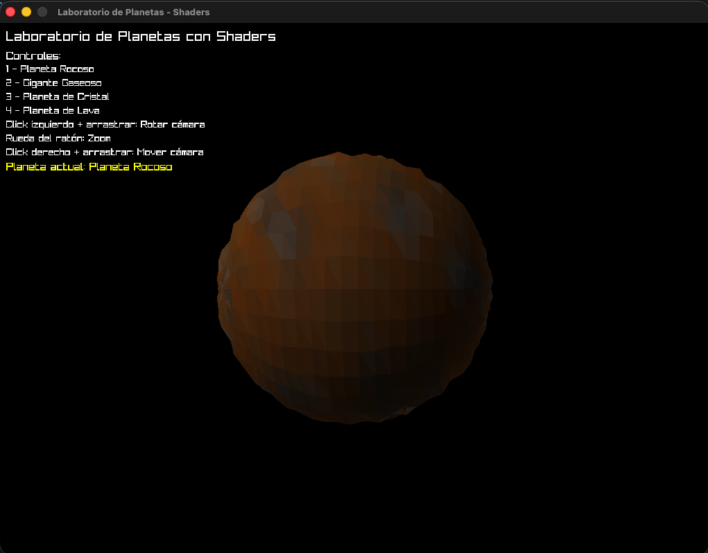
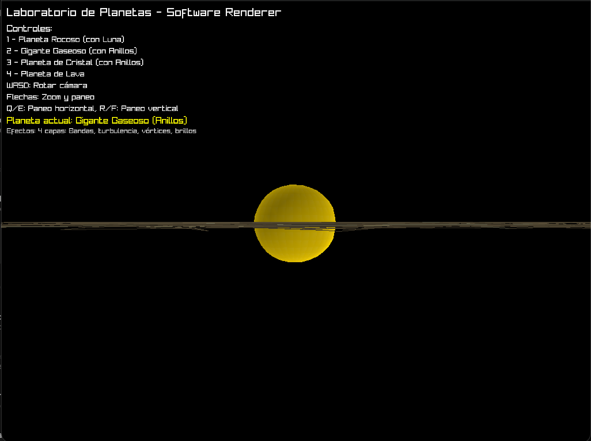
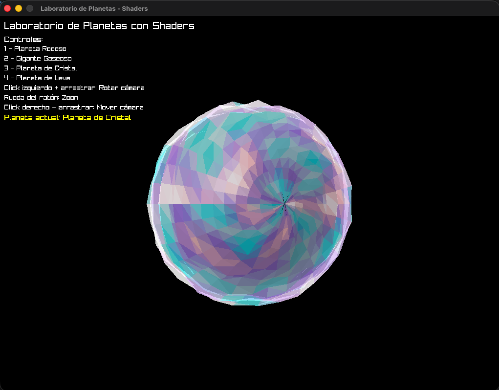
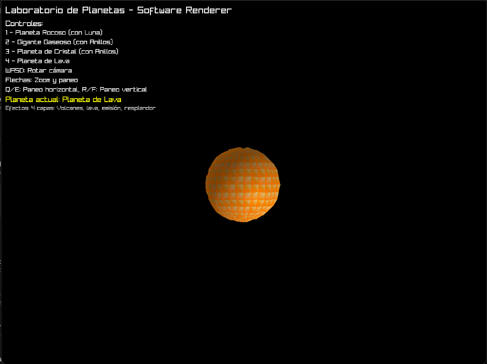

# Laboratorio de Planetas - Software Renderer

Este proyecto implementa un **software renderer completo** que visualiza planetas procedurales, demostrando los conceptos fundamentales de gráficas por computadora vistos en clase.

## 📋 Conceptos Implementados

El proyecto implementa manualmente todos los componentes del pipeline de renderizado 3D:

✅ **Framebuffer personalizado** - No el de Raylib  
✅ **Multiplicación de matrices** - Explícita en cada frame  
✅ **Rasterización** - Con coordenadas baricéntricas  
✅ **Fragment shader** - Procesamiento por píxel  
✅ **Z-buffering** - Depth testing manual  
✅ **Pipeline completo** - 6 etapas implementadas

### Requisitos del Laboratorio
- ✅ **Cuatro tipos de planetas**: Rocoso, Gaseoso, Cristal, y Lava
- ✅ **Usa sphere.obj**: Geometría cargada del archivo proporcionado
- ✅ **Sin texturas**: Todo es procedural con shaders
- ✅ **Características extras**: Anillos y luna procedurales

## 🪐 Planetas Implementados

### 1. Planeta Rocoso (Tecla 1)
- **Superficie rugosa** con montañas y cráteres
- **4 capas de efectos**: Montañas (ridge noise), cráteres (Voronoi), rugosidad (fbm), minerales
- **Incluye luna orbital** procedural



### 2. Gigante Gaseoso (Tecla 2)  
- **Bandas atmosféricas** dinámicas que cambian con el tiempo
- **4 capas de efectos**: Bandas base, turbulencia, vórtices, brillos atmosféricos
- **Incluye sistema de anillos** procedurales



### 3. Planeta de Cristal (Tecla 3)
- **Efectos cristalinos** con refracción y brillos especulares
- **4 capas de efectos**: Cristales base, refracción, especular, patrones de energía
- **Incluye sistema de anillos** procedurales



### 4. Planeta de Lava (Tecla 4)
- **Mundo volcánico** con lava fundida y actividad geotérmica  
- **4 capas de efectos**: Roca volcánica, lava fundida, emisión de calor, resplandor



## 🛠️ Librerías Utilizadas

### **Raylib**
- **Propósito**: Solo para crear ventana y mostrar la textura del framebuffer
- **Uso**: Creación de ventana, manejo de eventos de teclado, display final
- **NO se usa**: `draw_triangle`, `draw_line` u otras funciones de dibujo de Raylib
- **Razón**: Todo el renderizado se hace manualmente en el framebuffer personalizado

## 🏗️ Arquitectura del Proyecto

### **Pipeline de Renderizado (Software Renderer)**

El proyecto implementa el pipeline completo de gráficas 3D de forma manual:

```
┌─────────────────────────────────────────────────┐
│ 1. VERTEX SHADER                                │
│    - Transformación de vértices                 │
│    - Aplicación de efectos procedurales         │
└──────────────┬──────────────────────────────────┘
               │
┌──────────────▼──────────────────────────────────┐
│ 2. PRIMITIVE ASSEMBLY                           │
│    - Agrupación de vértices en triángulos      │
└──────────────┬──────────────────────────────────┘
               │
┌──────────────▼──────────────────────────────────┐
│ 3. RASTERIZATION (Coordenadas Baricéntricas)   │
│    - Conversión de triángulos a fragmentos     │
│    - Interpolación de atributos                 │
└──────────────┬──────────────────────────────────┘
               │
┌──────────────▼──────────────────────────────────┐
│ 4. FRAGMENT SHADER                              │
│    - Cálculo de color procedural por píxel     │
│    - Iluminación y efectos                      │
└──────────────┬──────────────────────────────────┘
               │
┌──────────────▼──────────────────────────────────┐
│ 5. Z-BUFFER TEST                                │
│    - Comparación de profundidad                 │
│    - Descarte de fragmentos ocultos             │
└──────────────┬──────────────────────────────────┘
               │
┌──────────────▼──────────────────────────────────┐
│ 6. FRAMEBUFFER                                  │
│    - Escritura de píxeles finales               │
└─────────────────────────────────────────────────┘
```

### **Estructura de Módulos**

```
src/
├── framebuffer.rs    # Framebuffer personalizado + Z-buffer
├── fragment.rs       # Rasterización con coordenadas baricéntricas
├── matrix.rs         # Multiplicación de matrices y transformaciones
├── vector.rs         # Matemática vectorial 3D
├── shaders.rs        # Vertex y Fragment shaders procedurales
├── camera.rs         # Sistema de cámara orbital
├── sphere.rs         # Estructura de mesh
├── obj_loader.rs     # Carga de sphere.obj
└── main.rs           # Coordinación del pipeline
```

### **Transformaciones de Matriz**

En cada frame se aplican las siguientes multiplicaciones de matrices:

```
Posición Final = Viewport × Projection × View × Model × Vértice Original
```

- **Model Matrix**: Rotación del planeta
- **View Matrix**: Transformación de mundo a espacio de cámara
- **Projection Matrix**: Perspectiva 3D → 2D
- **Viewport Matrix**: Normalizado → Coordenadas de pantalla

## 🎮 Controles

- **1-4**: Cambiar entre planetas
- **WASD**: Rotar cámara
- **Flechas**: Zoom y paneo horizontal  
- **Q/E**: Paneo horizontal
- **R/F**: Paneo vertical

## 🚀 Compilación y Ejecución

```bash
# Compilar
cargo build --release

# Ejecutar  
cargo run --release
```

## ⭐ Características Técnicas

### **Implementación Manual del Pipeline**
- **Framebuffer**: Buffer de píxeles propio (`Vec<Color>`)
- **Z-Buffer**: Depth testing manual para visibilidad correcta
- **Rasterización**: Algoritmo de coordenadas baricéntricas
- **Interpolación**: Color, normales y profundidad por píxel

### **Shaders Procedurales**
Cada planeta tiene 4+ capas de efectos que se combinan:
- Colores base del material
- Efectos de ruido procedural (FBM, Voronoi, Ridge)
- Iluminación (difusa, especular, rim lighting)
- Efectos temporales animados

### **Elementos Adicionales**
- **Anillos**: 8 anillos concéntricos procedurales
- **Luna**: Órbita realista con superficie procedural
- **Rotación planetaria**: Cada planeta rota a velocidad diferente

---

**Desarrollado para Gráficas por Computadora - Universidad del Valle de Guatemala**  
**Por: José Ruiz**